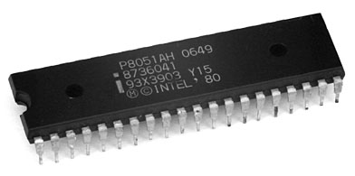
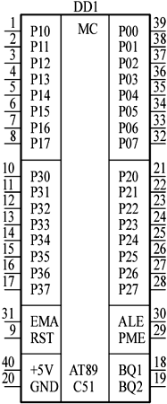

# Intel_8051_Microcontroller
A set of various programs for Intel 8051 Microcontroller

### LED movement animation ###
The program sequentially turns on the 4 LEDs that correspond to the high-order bits of P3, and then shift these 4 LEDs 
from the high-order bits of P3 to the low-order bits of P1. After the LEDs reach the lower bits of P1, 
they are turned off sequentially. Total duration of the animation = 200 ms
   
### Music playing ###
The program plays a simple tune that consist of 26 notes after a keyboard button is pressed. 
The tune: https://www.youtube.com/watch?v=GFSRQ_U65TU

### Scrolling text animation ###

Scrolling text animation (left to right) on a display with 9 character positions

### Keyboard button display ###
Matrix keyboard processing program that displays the pressed buton on the LED display, which uses P3 port on the background
